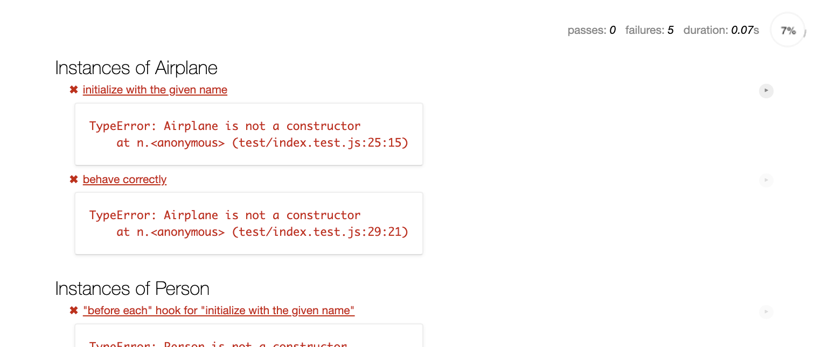
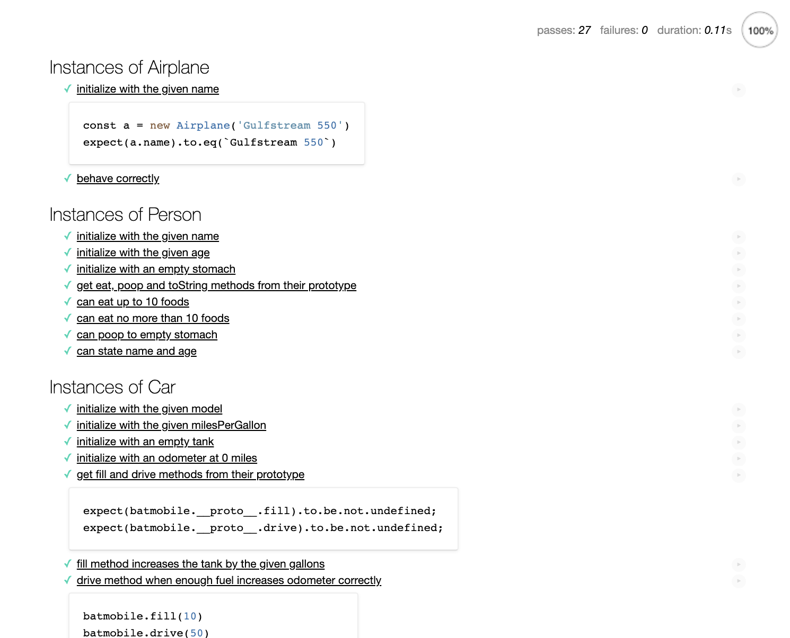

# Scope and Closure Challenge

The module challenge is the afternoon project or assignment that students work through independently. This expands on the guided project completed earlier with the instructor.

## JavaScript Foundations

## Scope and Closures

## Objectives

- Explain function scope
- Describe what closure is, how closure is created in a program and why it is important to understand closures in JavaScript  

## Introduction

This challenge focuses on both scope and closures.

In this challenge you will be working to build a `scoreboard` (in the console) that takes randomly generated data and keeps track of a game's progress. If you're not familiar with the rules of baseball what you need to know is this: there are 9 innings and teams take turns "at-bat." Teams can only score while they are at bat. A team stops being at bat once they have gotten 3 `outs` by either striking out or through game play. You can read more about baseball rules [here](https://www.rulesofsport.com/sports/baseball.html).

A scoreboard in a major league stadium looks something like this. In fact, the scoreboard at Fenway Park in Boston is actually quite famous. 


There are layers upon layers of nested functions within the game of baseball. Your challenge today will be to work through tasks associated with these layers, and ultimately to produce a scoreboard that logs in the console.

## Instructions

### Task 1 - Set Up Project and Tests

1. Fork repo and add TL as collaborator on Github
2. Clone _your_ fork (not Lambda's repo by mistake!)
3. `cd` into your newly cloned repository
1. Create a new branch by typing `git checkout -b <firstName-lastName>`
4. Install dependencies by typing `npm install`
5. Run tests by typing `npm run test:watch`
6. Work on your branch, push commits and create PR as usual

### Task 2a - MVP code

Find the file `index.js` and complete the tasks until your tests are passing.

### Task 2b - Written questions

Edit the `ReadMe` file with your answers.

1. In your own words, define closure (1-2 sentences).
2. Study the following code, then answer the questions below.

```js
function personalDice(name){
  return function(){
      // generate random number between 1 and 6
    const newRoll = Math.floor(Math.random() * 6);
    console.log(`${name} rolled a ${newRoll}`)
  }
}

const dansRoll = personalDice("Dan");

const zoesRoll = personalDice("Zoe");


dansRoll();
dansRoll();
```

a. Where is closure used in this code? How can you tell?
b. Compare and contrast calling `dansRoll` the first and second time. What is always the same? What could change?
c. What is the lexical scope of `newRoll`? 

### Task 3 - Stretch Goals

After you have completed the requirements, **create** a new file called `stretch.js` and practice more with closures. There are no tests for these problems.

See if you can complete one or more of the following challenges:

1. Predict the output of the code below and explain why this is the output using what you learned today. When you're ready for answers, view an explanation [here](https://www.coderbyte.com/algorithm/3-common-javascript-closure-questions

```js
(function(){
  var a = b = 3;
})();
console.log("a defined? " + (typeof a !== 'undefined'));
console.log("b defined? " + (typeof b !== 'undefined'));
```

2. Write a function that would allow you to do this using a closure. (This is another interview question we've seen before - when you're ready for answers, view an explanation [here](https://www.coderbyte.com/algorithm/3-common-javascript-closure-questions)).

```js
var addSix = createBase(6);
addSix(10); // returns 16
addSix(21); // returns 27
```

3. Research the differences between functional programming and object oriented programming. Then, describe the pros and cons of functional programming vs object-oriented programming. This is a common interview question and great practice!

## Testing FAQ


**What are Tests?**

- Lambda School staff members use tests to algorithmically check for required elements in a code file. For example, a test for the question "`console.log()` "hello [name]" using a variable `name` to hold the name" (not a question you will ever be asked, but I digress), might pass **if** your code includes a variable called `name` **and if** that variable was created with `const` **and** **if** `console.log` is called. Additional parameters could require that this code doesn't exceed 2 lines.
- Your tests work similarly, with more complex conditionals for what is considered passing and what is considered failing. These tests and associated error messages are meant to help you by providing informative error messages that are specific to the requirements of your project.
- Read more about testing frameworks [here](https://blog.bitsrc.io/top-javascript-testing-frameworks-in-demand-for-2019-90c76e7777e9) including how testing can be used at scale. Lambda School uses Mocha to test in JavaScript.

**How do I run tests in terminal?**

- Run tests by typing `npm run test:watch`.
- Testing in Terminal can be done in the terminal utility or VS code

**How do I run tests in my browser?**

- Open `index.html`
- You should see the following at first with failed tests and error messages

 

- Once your code is working you will see tests passing and can click on tests to view the code which made the test pass.

 

## Resources

📚 [Scope and Closures Guide](https://css-tricks.com/javascript-scope-closures/)

🧠 ["I never Understood Closures" Blog](https://medium.com/dailyjs/i-never-understood-javascript-closures-9663703368e8)

## Submission Format

Follow these steps for completing your project.

- [ ] Submit a pull request to merge <firstName-lastName> Branch into master (student's  Repo). **Please don't merge your own pull request**
- [ ] Add your Team Lead as a reviewer on the pull request
- [ ] Your Team Lead will count the project as complete by merging the branch back into master
